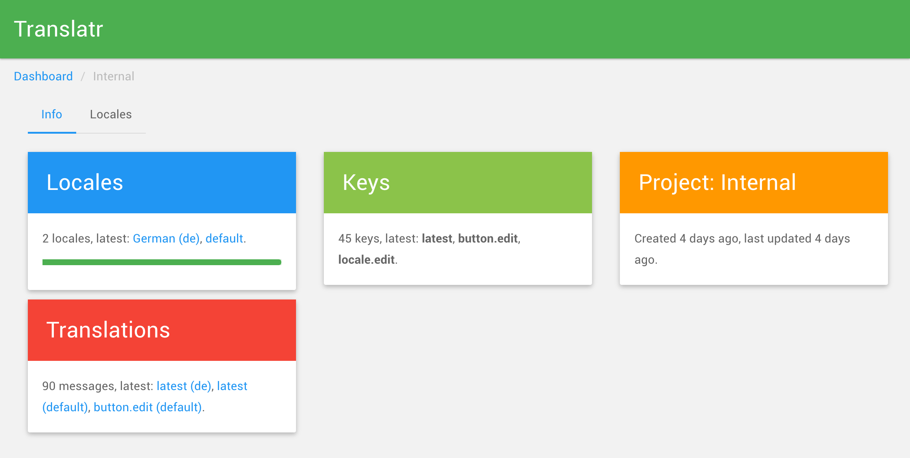

# Translatr

A modern and intuitive i18n tool. Translatr simplifies i18n for developers and translators. It uses the [Play Framework](http://www.playframework.com) to translate other projects using the Play Framework. Importing conf/messages.locale files allows easy locale creation.



## Speeds up development

Preview, quick switching between locales, and the possibility of build system integration allow faster development.

## User experience focused

Using the application is made as comfortable as possible because of focussing on both main use cases - development and translation.

## Easy to work with

All elements - search, content creation, notifications, ... - follow the concepts of Material Design to allow the easiest and most intuitive use possible.

# Command Line Interface

The Command Line Interface allows to manage translations through the command line. Operations can be used in build scripts to automatically retrieve the latest translations.

## Installation

Paste this at a terminal prompt:

```
curl -fsSL https://raw.githubusercontent.com/resamsel/translatr/master/install.sh | bash
```

## Usage

First, create a project in the web GUI and copy the project ID (40 character UUID in the URL, i.e. http://localhost:9000/project/6f1ee0a7-b5d1-4c7f-8e4d-46c09fece220 -> project ID: 6f1ee0a7-b5d1-4c7f-8e4d-46c09fece220).

Then put a .translatr.yml file in any directory that you want to enable pulling/pushing. Translatr will then use that file as configuration.

### Example .translatr.yml for Play messages

```
translatr:
  endpoint: http://localhost:9000
  project_id: 6f1ee0a7-b5d1-4c7f-8e4d-46c09fece220
  pull:
    file_type: play_messages
    target: conf/messages.?{locale.name}
  push:
    file_type: play_messages
    target: conf/messages.?{locale.name}
```

### Pushing

By pushing you send the matching messages files to the given endpoint, creating locales if needed.

```
translatr push
```

This will overwrite all existing messages, if any. No existing keys/locales will be removed, this is not a sync operation.

### Pulling

By pulling you download all locales into separate files into the configured files (translatr.pull.target key).

```
translatr pull
```

This will overwrite any existing files locally. All known locales will be downloaded.

# Deployment

In root repository directory:

```
git subtree push --prefix translatr heroku master
```