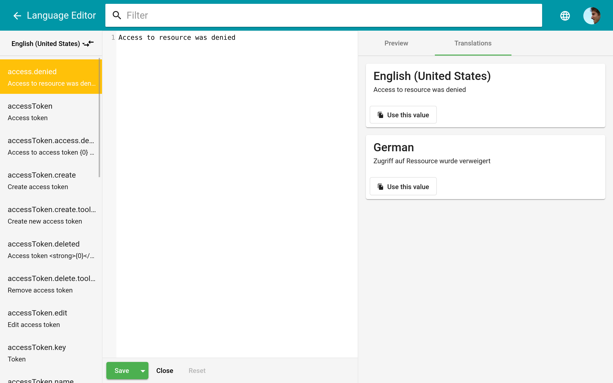
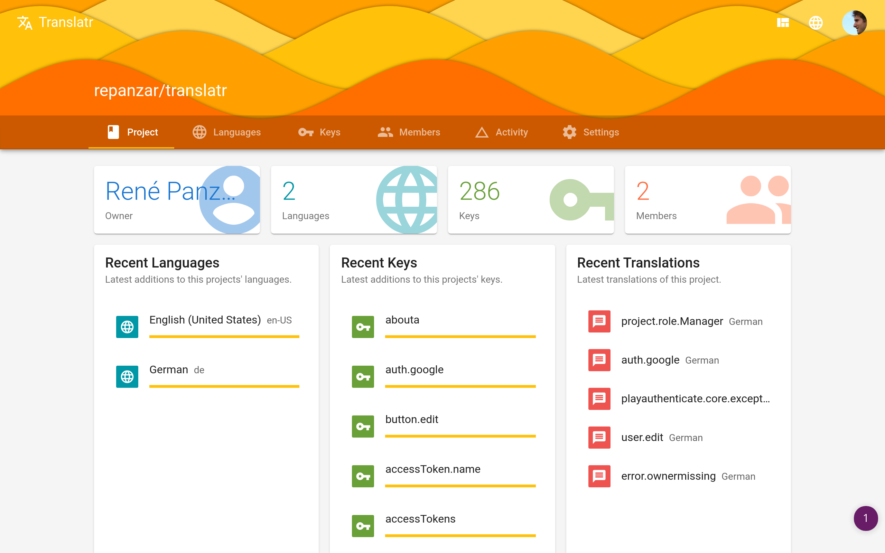
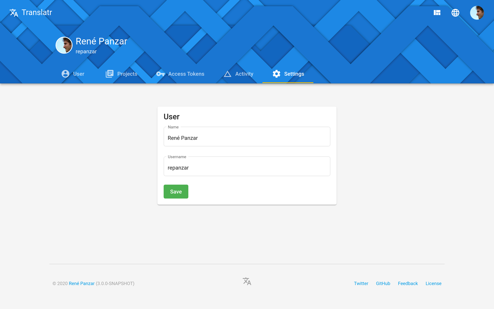
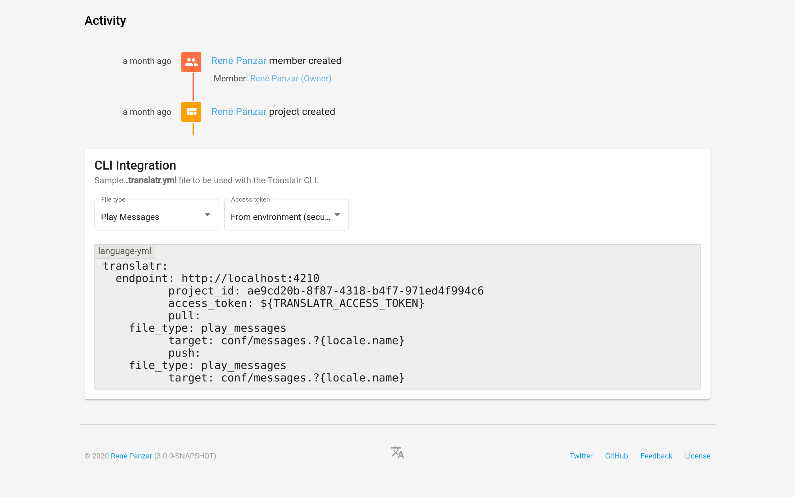

# Translatr [](https://travis-ci.org/resamsel/translatr) [](https://coveralls.io/github/resamsel/translatr?branch=master) [](http://makeapullrequest.com)

A modern and intuitive i18n tool. Translatr simplifies i18n for developers and translators. It uses
the [Play Framework](http://www.playframework.com) to translate other projects. Importing
`conf/messages.locale` (Play Framework), `src/main/resources/messages_locale.properties` (Java
properties), and `i18n/locale/main.po` (Gettext) files allows easy locale management.

[Demo](https://translatr.repanzar.com/)


## Speeds up development

Preview, quick switching between locales, and the possibility of build system integration allows
faster development.



## User experience focused

Using the application should feel as comfortable as possible because of focusing on both main use
cases - development and translation.



## Easy to work with

All elements - search, content creation, ... - follow the concepts of Material
Design to allow the easiest and most intuitive usage possible.



# Command Line Interface

The Command Line Interface allows managing translations through the command line. Operations
can be used in build scripts to automatically retrieve the latest translations.

## Installation

Paste this at a terminal prompt:

```
curl -fsSL https://raw.githubusercontent.com/resamsel/translatr/master/install.sh | bash
```

## Usage

To use Translatr CLI we need a `.translatr.yml` config file. Create one in any directory that you
want to enable the CLI. The Translatr CLI will then use that file as configuration.

Creating a config file is easy with version 3. On the project page, scroll down to the CLI
Integration card. You'll find a sample file, along with the option of choosing the file type and
the access token.



### Pushing

By pushing you send the matching messages files to the given endpoint, creating locales if needed.

```
translatr push
```

This will overwrite all existing messages, if any. No existing keys/locales will be removed, this is not a sync operation.

### Pulling

By pulling you download all locales into separate files into the configured files (translatr.pull.target key).

```
translatr pull
```

This will overwrite any existing files locally. All known locales will be downloaded.

## Developing

### Prerequisites

For development, you need the following dependencies.

1. Java 8 JDK (i.e. OpenJDK 8)
1. Docker
1. Docker Compose
1. Node.js

### Using IntelliJ IDEA

1. Run the compile SBT task

   ```
   bin/activator compile
   ```

1. Import project in IntelliJ IDEA as a _Scala_ project
1. Run the run configuration named _Start Database_
1. Run the run configuration named _Start Server_
1. Go to [localhost:4210/ui](http://localhost:4210/ui) to see it running

### Running it Manually

1. Run the compile SBT task

   ```
   bin/activator compile
   ```

1. Run database container by using _docker compose_

   ```
   export POSTGRES_PASSWORD=translatr
   docker-compose up
   ```

1. Run development server

   ```
   export AUTH_PROVIDERS=keycloak
   export KEYCLOAK_CLIENT_ID=translatr-localhost
   export KEYCLOAK_CLIENT_SECRET=$YOUR_KEYCLOAK_CLIENT_SECRET
   export REDIRECT_BASE=http://localhost:4210
   bin/activator ~run -Dconfig.file=dev.conf
   ```

1. Go to [localhost:4210/ui](http://localhost:4210/ui) to see it running

## Contributing

Information about contributing to this project can be found on the
[CONTRIBUTING](CONTRIBUTING.md) page.
